# Pollio

## Overview
This pipeline implements a comprehensive genetic analysis framework for evaluating sprint performance potential through genomic variants. It combines high-performance computing with biological network analysis to provide insights into an individual's genetic predisposition for sprint-related athletic performance.

## Scientific Background

### Genetic Basis of Sprint Performance
Sprint performance is influenced by multiple genetic factors affecting:
- Muscle fiber composition (fast-twitch vs. slow-twitch)
- Energy metabolism efficiency
- Oxygen utilization
- Recovery capacity
- Neuromuscular coordination

### Mathematical Framework

#### 1. Variant Scoring
The individual variant score is calculated as:

$S_{variant} = \sum_{i=1}^{n} w_i \cdot g_i$

Where:
- $w_i$ is the weight of variant i
- $g_i$ is the genotype impact factor
- $n$ is the total number of variants

#### 2. Network Centrality
For each gene in the network, we calculate:

Betweenness Centrality:
$C_B(v) = \sum_{s,t \in V} \frac{\sigma(s,t|v)}{\sigma(s,t)}$

Eigenvector Centrality:
$x_v = \frac{1}{\lambda} \sum_{t \in N(v)} x_t$

#### 3. Composite Sprint Score
The final sprint score incorporates both genetic and network features:

$Score_{sprint} = \alpha \cdot \sum_{i=1}^{n} (V_i \cdot W_i) + \beta \cdot \sum_{j=1}^{m} N_j$

Where:
- $V_i$ is the variant score
- $W_i$ is the variant weight
- $N_j$ is the network importance
- $\alpha, \beta$ are scaling factors

### Pipeline Architecture

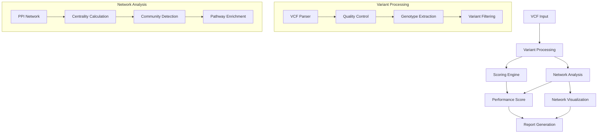

### Data Flow

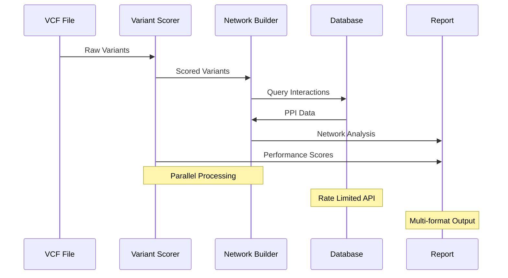

### Parallel Processing Architecture

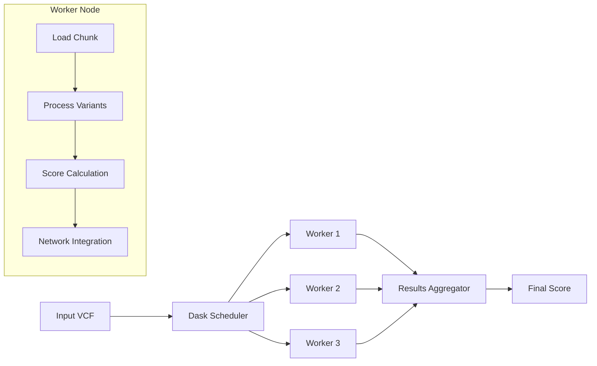

## Technical Implementation Details

### Sprint-Specific Genetic Markers

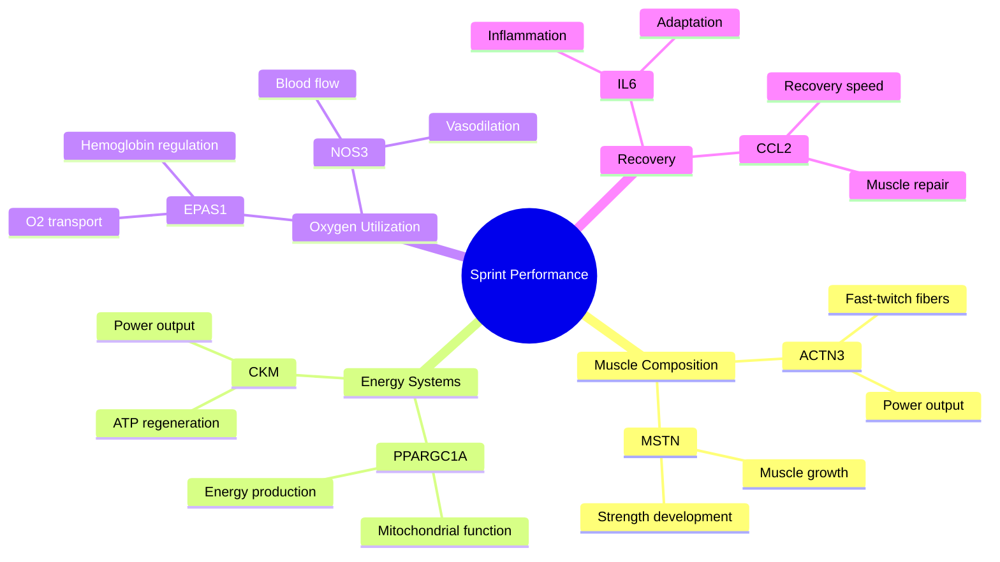

### Variant Processing Pipeline

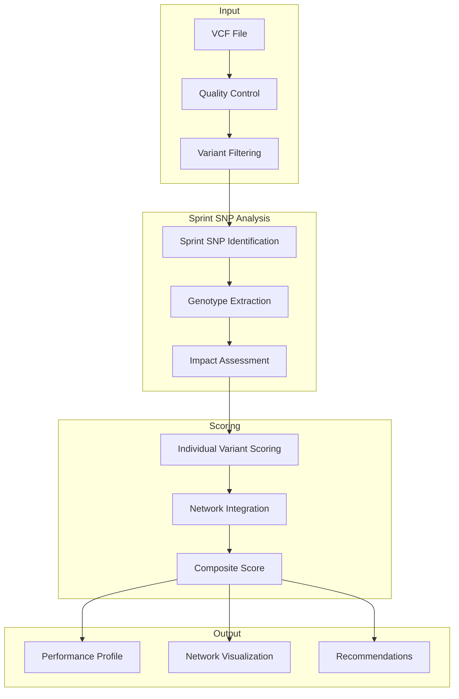

### Algorithm Implementations

#### 1. VCF Processing
```pseudocode
Algorithm: ProcessVariant
Input: variant_record, quality_threshold, depth_threshold
Output: processed_variant or null

BEGIN
    IF variant.quality < quality_threshold THEN
        RETURN null
    END IF
    
    IF variant.depth < depth_threshold THEN
        RETURN null
    END IF
    
    processed_variant = {
        id: variant.identifier,
        chromosome: variant.chromosome,
        position: variant.position,
        reference: variant.ref_allele,
        alternate: variant.alt_allele,
        quality: variant.quality,
        genotype: ExtractGenotype(variant)
    }
    
    RETURN processed_variant
END
```

#### 2. Sprint Score Calculation
```pseudocode
Algorithm: CalculateSprintScore
Input: variants[], weights[], network_data
Output: sprint_performance_score

BEGIN
    base_scores = []
    
    FOR EACH variant IN variants DO
        IF variant.id IN sprint_related_variants THEN
            base_score = CalculateGenotypeImpact(variant)
            weighted_score = base_score * weights[variant.id]
            base_scores.APPEND(weighted_score)
        END IF
    END FOR
    
    network_factor = CalculateNetworkInfluence(variants, network_data)
    raw_score = MEAN(base_scores) * network_factor
    
    normalized_score = NormalizeScore(raw_score)
    
    RETURN normalized_score
END
```

#### 3. Network Analysis
```pseudocode
Algorithm: BuildSprintNetwork
Input: genes[], interaction_threshold
Output: network_graph

BEGIN
    network = InitializeGraph()
    
    FOR EACH gene IN genes DO
        network.AddNode(gene)
    END FOR
    
    interactions = QueryProteinDatabase(genes)
    
    FOR EACH interaction IN interactions DO
        IF interaction.confidence >= interaction_threshold THEN
            network.AddEdge(
                interaction.protein1,
                interaction.protein2,
                weight: interaction.score
            )
        END IF
    END FOR
    
    centrality_scores = CalculateCentrality(network)
    communities = DetectCommunities(network)
    
    RETURN network
END
```

### Network Analysis Architecture

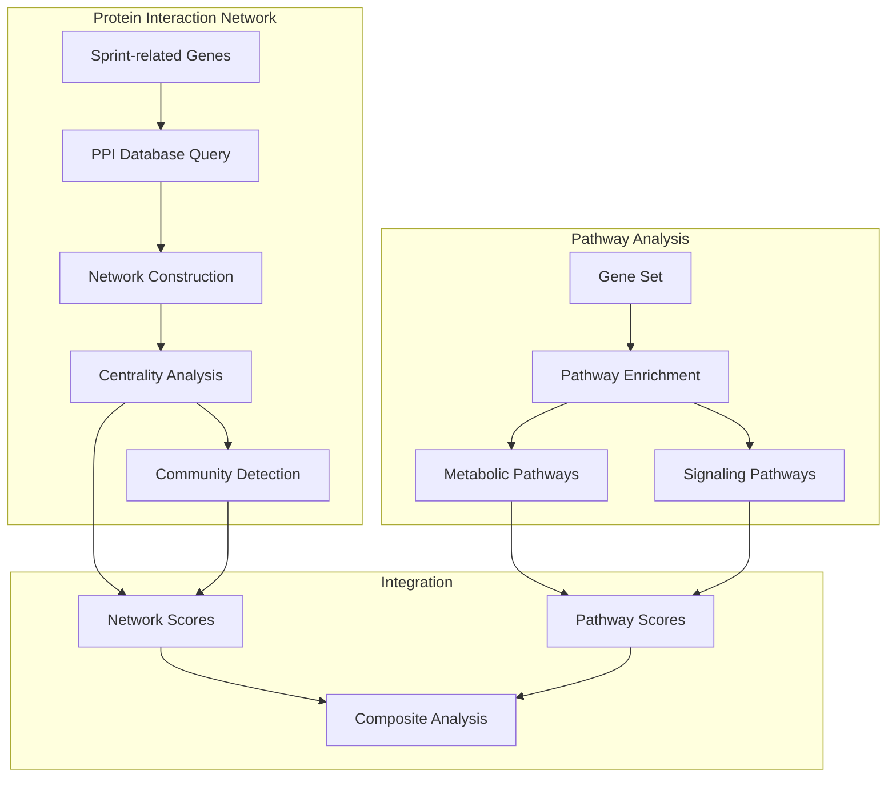

### Performance Metrics Calculation

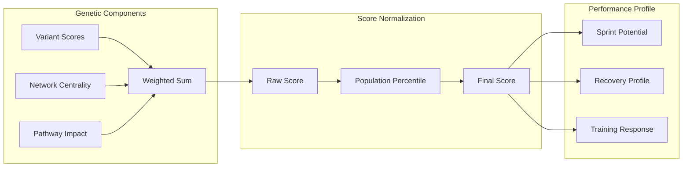

### Metabolic Pathway Analysis

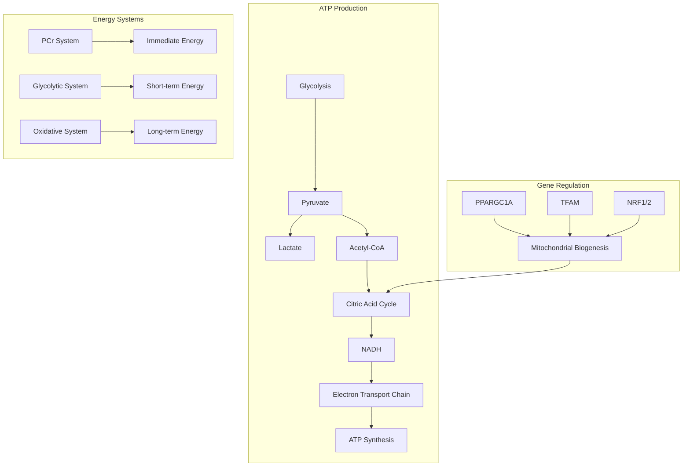

### Muscle Fiber Type Distribution

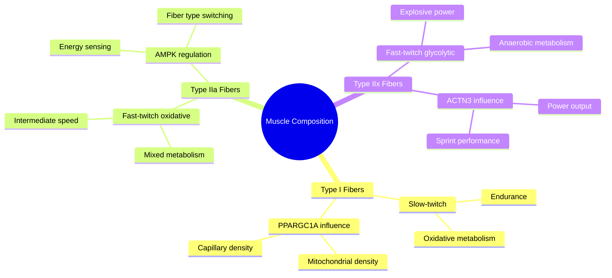

### Recovery Mechanism Analysis

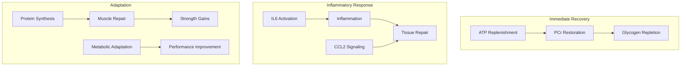

### Performance Prediction Model

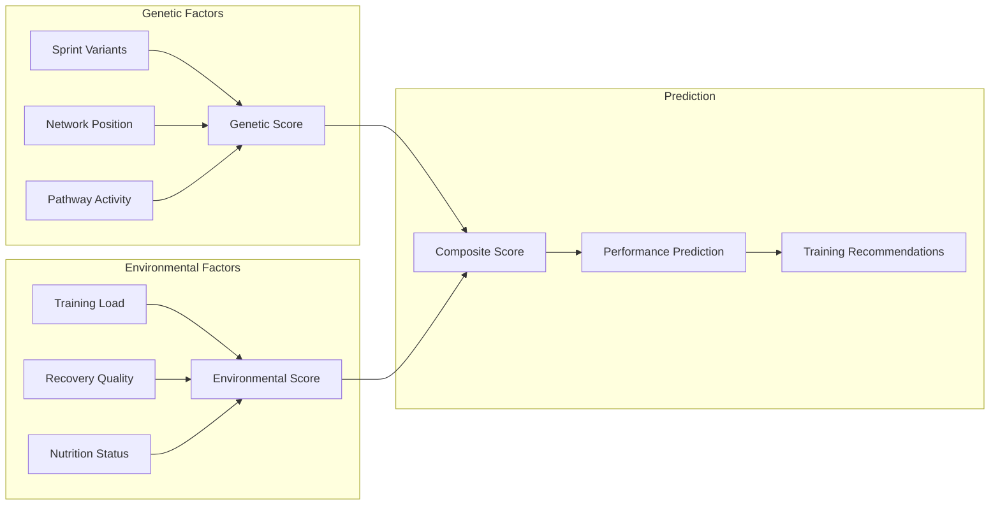

### Detailed Algorithm Implementations

#### 1. Variant Impact Assessment
```pseudocode
Algorithm: AssessVariantImpact
Input: variant_data, pathway_database, interaction_network
Output: impact_score

BEGIN
    // Initialize impact components
    direct_impact = 0.0
    network_impact = 0.0
    pathway_impact = 0.0
    
    // Direct variant effect
    IF variant_data.genotype == beneficial_homozygous THEN
        direct_impact = 1.0
    ELSE IF variant_data.genotype == heterozygous THEN
        direct_impact = 0.5
    END IF
    
    // Network position effect
    node_centrality = CalculateCentrality(variant_data.gene, interaction_network)
    network_impact = node_centrality * network_weight
    
    // Pathway involvement
    pathway_count = CountPathwayInvolvement(variant_data.gene, pathway_database)
    pathway_impact = NormalizePathwayScore(pathway_count)
    
    // Composite impact score
    impact_score = (
        direct_impact * 0.5 +
        network_impact * 0.3 +
        pathway_impact * 0.2
    )
    
    RETURN impact_score
END
```

#### 2. Training Response Prediction
```pseudocode
Algorithm: PredictTrainingResponse
Input: genetic_profile, training_history, recovery_metrics
Output: response_prediction

BEGIN
    // Initialize components
    power_adaptation = 0.0
    recovery_capacity = 0.0
    injury_risk = 0.0
    
    // Genetic power potential
    FOR EACH variant IN power_related_variants DO
        power_adaptation += AssessVariantImpact(variant) * variant_weight
    END FOR
    
    // Recovery capacity assessment
    FOR EACH variant IN recovery_related_variants DO
        recovery_capacity += AssessVariantImpact(variant) * recovery_weight
    END FOR
    
    // Injury risk calculation
    FOR EACH variant IN injury_related_variants DO
        injury_risk += AssessVariantImpact(variant) * risk_weight
    END FOR
    
    // Composite prediction
    response_prediction = {
        power_score: NormalizePowerScore(power_adaptation),
        recovery_score: NormalizeRecoveryScore(recovery_capacity),
        risk_score: NormalizeRiskScore(injury_risk),
        training_recommendations: GenerateRecommendations(
            power_adaptation,
            recovery_capacity,
            injury_risk
        )
    }
    
    RETURN response_prediction
END
```

### Network Analysis Visualization

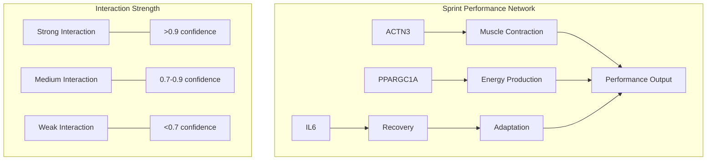

## Installation Requirements

1. Basic Requirements:
```bash
pip install -r requirements.txt
```

2. For Flow Diagrams:
- Install Mermaid support in your Markdown viewer
- For GitHub: Mermaid diagrams are supported natively
- For local development:
```bash
npm install -g @mermaid-js/mermaid-cli
```

3. System Dependencies:
```bash
# Ubuntu/Debian
sudo apt-get update
sudo apt-get install build-essential libhdf5-dev

# CentOS/RHEL
sudo yum groupinstall "Development Tools"
sudo yum install hdf5-devel

# macOS
brew install hdf5
```

4. Python Dependencies:
```python
# requirements.txt
numpy>=1.21.0
pandas>=1.3.0
cyvcf2>=0.30.0
networkx>=2.6.0
dask>=2021.8.0
distributed>=2021.8.0
matplotlib>=3.4.0
seaborn>=0.11.0
requests>=2.26.0
scipy>=1.7.0
h5py>=3.0.0
```

## Key Components

### 1. Variant Processing
- VCF file parsing using cyvcf2
- Genotype extraction and validation
- Quality control metrics
- Variant annotation and filtering

### 2. Scoring Engine
- Genotype impact assessment
- Variant weight application
- Network centrality integration
- Performance score calculation

### 3. Network Analysis
- Protein-protein interaction network construction
- Pathway enrichment analysis
- Community detection
- Centrality metrics calculation

### 4. Database Integration
- Real-time biological database queries
- Data caching and management
- Rate limiting and error handling
- Result aggregation

## Performance Optimization

### Parallel Processing
The pipeline utilizes Dask for distributed computing:

```pseudocode
Algorithm: ParallelVariantProcessing
Input: variants[], num_workers
Output: processed_results[]

BEGIN
    Initialize Dask cluster with num_workers
    chunk_size = len(variants) / num_workers
    results = []
    
    FOR EACH chunk IN SplitIntoChunks(variants, chunk_size) DO
        future = SubmitToWorker(ProcessVariants, chunk)
        results.APPEND(future)
    END FOR
    
    processed_results = WaitForCompletion(results)
    RETURN processed_results
END
```

### Memory Management
- Efficient VCF parsing using cyvcf2
- Streaming data processing for large genomic datasets
- Caching of database queries

## Analyzed Variants

The pipeline analyzes key sprint-related genetic variants including:

| Gene    | SNP ID     | Effect                           | Impact Factor |
|---------|------------|----------------------------------|---------------|
| ACTN3   | rs1815739  | Fast-twitch muscle fiber comp.   | 1.0          |
| ACE     | rs4341     | Muscle efficiency                | 0.9          |
| PPARGC1A| rs8192678  | Mitochondrial function          | 0.8          |
| IL6     | rs1800795  | Recovery and inflammation        | 0.7          |
| EPAS1   | rs1867785  | Oxygen processing               | 0.8          |
| BDKRB2  | rs1799722  | Exercise efficiency             | 0.7          |

## Usage

```python
from src.pipeline import SprintGenomePipeline

# Initialize pipeline
pipeline = SprintGenomePipeline(
    vcf_path="path/to/your.vcf.gz",
    output_dir="results",
    config_path="config/pipeline_config.json"
)

# Run analysis
results = pipeline.run_pipeline()
```

## Output

The pipeline generates:
1. Variant scores and genotype impacts
2. Network analysis visualizations
3. Performance prediction metrics
4. Detailed HTML/PDF reports

## Future Developments

1. Machine Learning Integration
   - Performance prediction models
   - Pattern recognition in genetic profiles

2. Extended Analysis
   - Epigenetic factor integration
   - Environmental interaction analysis
   - Longitudinal performance correlation

3. Advanced Visualization
   - 3D network visualization
   - Interactive pathway mapping
   - Real-time analysis updates

## Contributing
[Contribution guidelines for this project](CONTRIBUTING.md)

## License
This project is licensed under the MIT License - see the [LICENSE.md](LICENSE.md) file for details.

## References
1. Yang, N., et al. (2003). ACTN3 genotype is associated with human elite athletic performance. American Journal of Human Genetics.
2. Ahmetov, I.I., et al. (2016). Genes and Athletic Performance. Advances in Clinical Chemistry.
3. Bouchard, C., et al. (2011). Genomic predictors of trainability. Experimental Physiology.

## Acknowledgments
- [Dante Labs](https://dantelabs.com/) for genomic data processing
- [String-DB](https://string-db.org/) for protein interaction data
- [Reactome](https://reactome.org/) for pathway analysis
